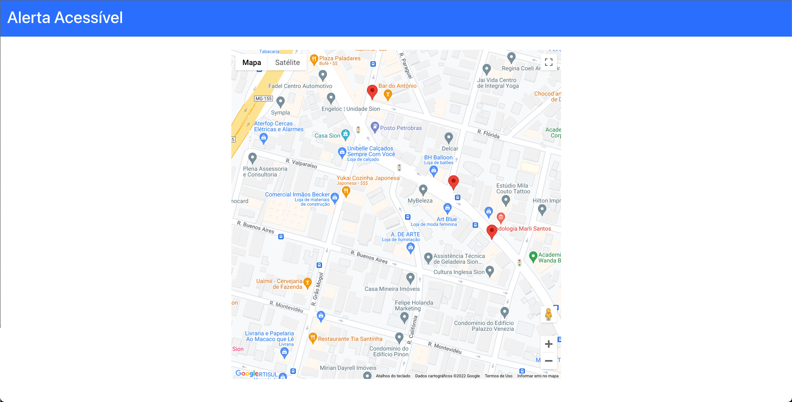

---
presentation:
  theme: "black.css"
---

<!-- slide -->

- "O seu foco determina a sua realidade."
 
 
Qui-Gon Jinn

<!-- slide  -->

<!-- slide  -->
Acessibilidade

<!-- slide  -->

<!-- slide  -->

<!-- slide  -->

<!-- slide  -->
E se a gente pensasse Sistemas para a Internet com o intuito de mudar a vida das pessoas com deficiência (PCD)? 🤔

<!-- slide  -->
Primeiro passo

https://github.com/andregmdias/stellantis_challenge
WIP 🚧

<!-- slide  -->
Desafios do desenvolvimento
- Escolha do framework
- Esconder chave de API

<!-- slide  -->
Ferramentas
- Bootstrap
- Local Storage
- React
- Google Maps API

<!-- slide  -->
Próximos Passos
- Back-End
- Sistema de login
- Adição de descrição para os marcadores
- Adição de fotos para os marcadores